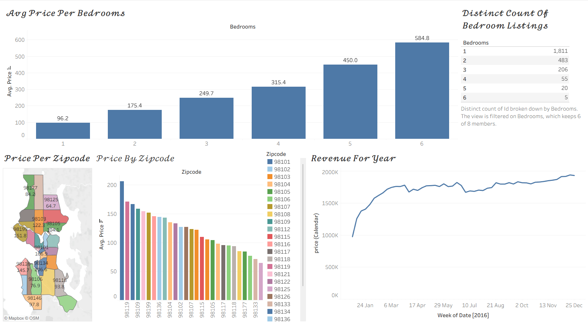

# Airbnb-Tableau-dashboard
Tableau dashboard analyzing Seattle Airbnb pricing, listings and revenue.
# Seattle Airbnb Tableau Dashboard

Interactive Tableau dashboard analyzing Seattle Airbnb pricing, listings and revenue.

## Live Dashboard
[View on Tableau Public](https://public.tableau.com/app/profile/shakeel.navas.khan/viz/AirBnbFullProject_17911327523280/Dashboard1)

## What the dashboard shows
- **Average price per bedroom count:** price rises from about $96 for 1 bedroom to about $585 for 6 bedrooms
- **Listing counts by bedrooms:** most listings are 1-bedroom (1,811), and large homes are rare
- **Price by zipcode:** a map and bar chart comparing average price across Seattle zipcodes
- **Revenue over 2016:** weekly trend line showing growth through the year

## Tools
Tableau Public

## Files
- `AirBnb Full Project.twbx`: Tableau packaged workbook
- `Dashboard.png`: dashboard screenshot

## Dataset
Seattle Airbnb data (Listings, Calendar, Reviews)
